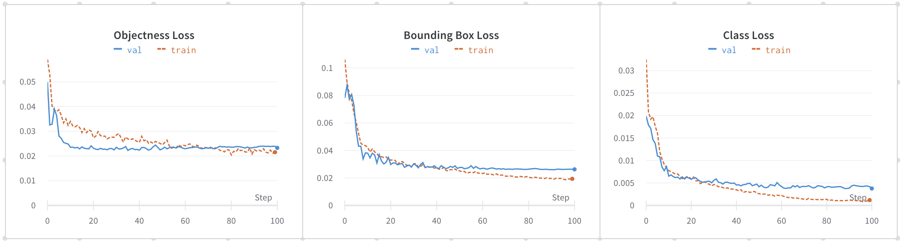
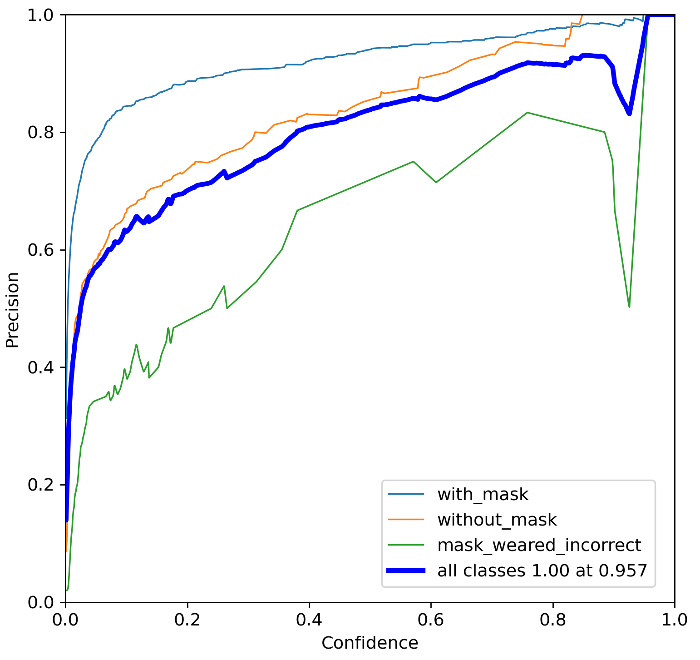
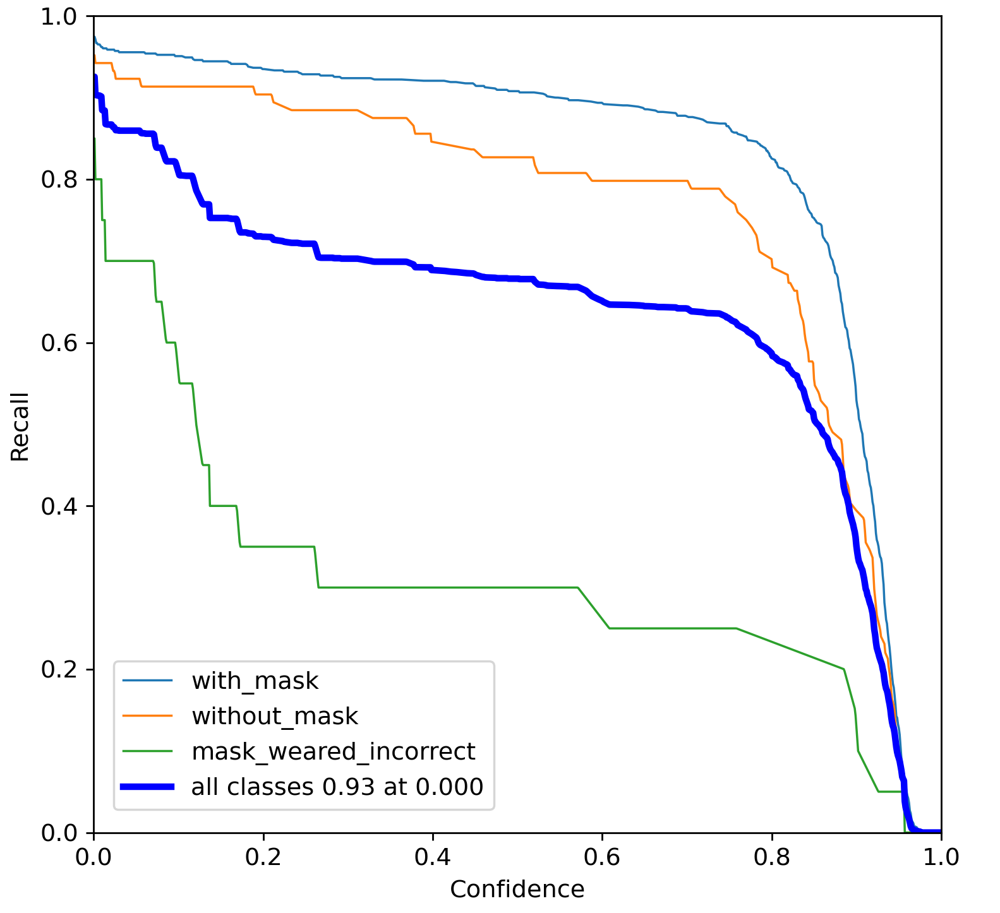
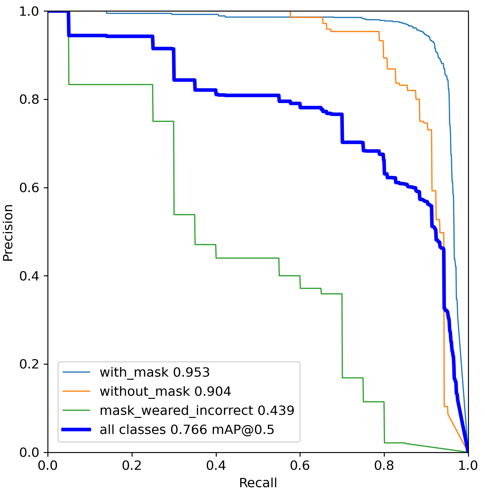
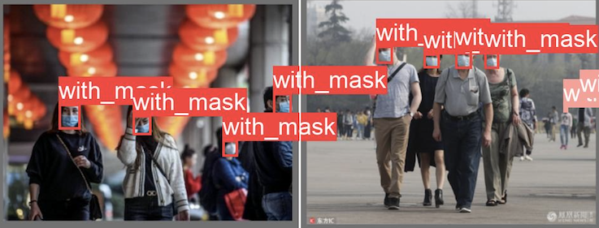
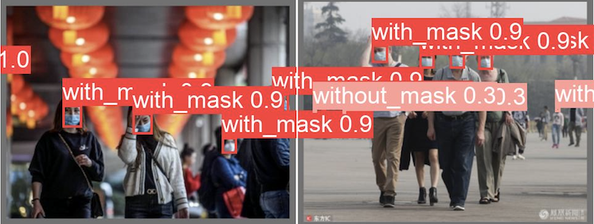
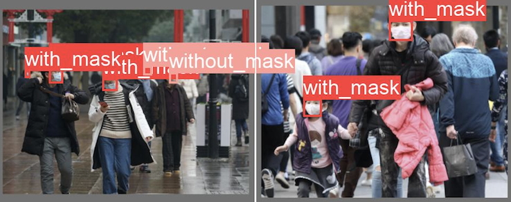
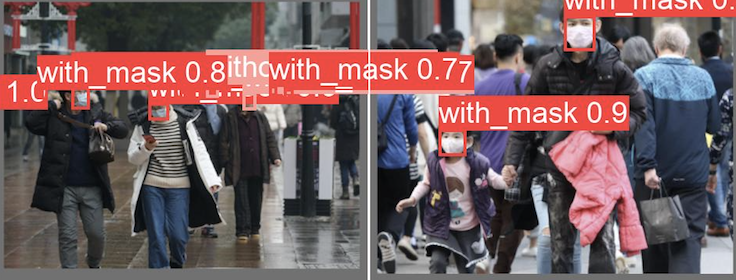
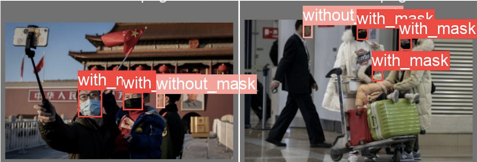
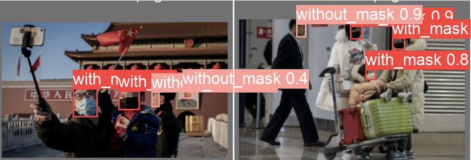

# Face Mask Detection
Face mask detection is an object detection task that detects whether people are wearing masks or not in videos. This repo includes a demo for building a face mask detector using YOLOv5 model. 
<p align="center"> </p>

### Dataset
The model was trained on [Face-Mask](https://www.kaggle.com/andrewmvd/face-mask-detection) dataset which contains 853 images belonging to 3 classes, as well as their bounding boxes in the PASCAL VOC format. The classes are defined as follows:
* `With mask`
* `Without mask`
* `Mask worn incorrectly`

### Setup
* Clone this repo and install YOLOv5:
```
git clone https://github.com/spacewalk01/face-mask-detection
cd face-mask-detection

# Install yolov5
git clone https://github.com/ultralytics/yolov5
cd yolov5
pip install -r requirements.txt
```

#### Training
* Download [Face-Mask](https://www.kaggle.com/andrewmvd/face-mask-detection) dataset from Kaggle and copy it into `datasets` folder. 
* Execute the following command to automatically unzip and convert the data into the YOLO format and split it into train and valid sets. The split ratio was set to 80/20%.
```
cd ..
python prepare.py
```
* Start training:
```
cd yolov5
python train.py --img 640 --batch 16 --epochs 100 --data ../mask_config.yaml --weights yolov5s.pt --workers 0
```
#### Inference
* If you train your own model, use the following command for inference:
```
python detect.py --source ../datasets/input.mp4 --weights runs/train/exp/weights/best.pt --conf 0.2
```
* Or you can use the pretrained model `models/mask_yolov5s.pt` for inference as follows:
```
python detect.py --source ../datasets/input.mp4 --weights ../models/mask_yolov5.pt --conf 0.2
```

### Results
The following charts were obtained after training YOLOv5s with input size 640x640 on the `Face Mask` dataset for 100 epochs.

<p align="center">
  
</p>

Precision-Recall (PR) measures the accuracy of bounding box overlap between predicted bboxes and ground truth bboxes. 
| Precision Curve | Recall Curve | PR Curve |
| :-: | :-: | :-: |
| <p align="center"> </p> | <p align="center"> </p> | <p align="center"> </p> |

The following metrics were measured on the valid dataset containing 171 images. High precision and recall scores were obtained on `with mask` and `without mask` classes. However, the performance on `mask weared incorrectly` class was poor due to the imbalanced data.

| Class | #Labels | Precision | Recall | mAP<sup>val<br>0.5 | mAP<sup>val<br>0.5:0.95 |
| :-: | :-: | :-: | :-: | :-: | :-: |
| `with mask` | 630 | 0.94 | 0.9 | 0.95 | 0.64 |
| `without mask` | 104 | 0.86 | 0.82 |  0.9 |  0.6 |
| `mask weared incorrectly` | 20 | 0.72 | 0.3 | 0.43 | 0.24 |
| `total` | 754 | 0.84 | 0.67 | 0.76 | 0.49 |

#### Ground Truths vs Predictions

| Ground Truth | Prediction | 
| :-: | :-: |
|  |  |
|  |  | 
|  |  | 
  
### Reference

* [Darknet](https://github.com/pjreddie/darknet/blob/master/scripts/voc_label.py)
* [YOLOv5](https://github.com/ultralytics/yolov5)
